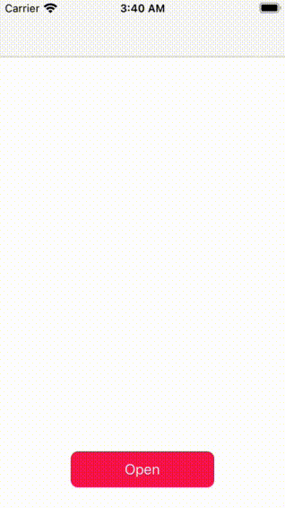
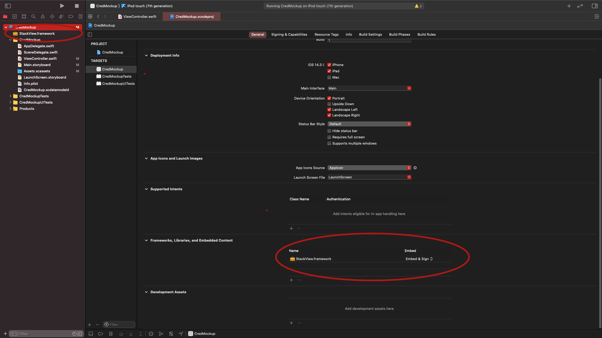
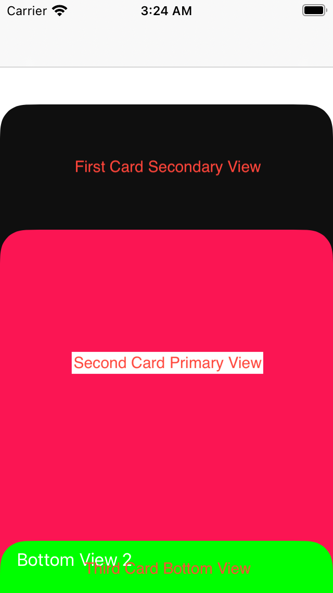

# Stack View Framework

This is a framework inspired by [this dribble shot](https://dribbble.com/shots/5721735-InVision-Studio-Spaced-App) and is an abstraction layer that controls and defines the relevant stack card views. 

## Basic Example

<p align="center">
  
</p>

Better quality of this video can be viewed [here](https://raw.githubusercontent.com/jainvandit99/StackView-Framework/main/Assets/screenGrab.mov).

## Usage

### Installation 
Download the framework file from [here](Assets/StackView.framework.zip) and place it in the root directory of your Xcode project as show in the image below



Import the module into your code:
```Swift
import StackView
```

### Declaration

Declare it like any other view
```Swift
let stackView = StackView()
```
Initialising frame to width and height
```Swift
stackView.frame = CGRect(x: 0, y: 0, width: self.view.frame.width, height: self.view.frame.height)
```
To add cards to the stack, the ```view``` takes in an array of ```StackCardView```

```Swift
private var cardViews = [StackCardView]()
```

```StackCardView``` is an object that consists of a ```primaryView```, ```secondaryView``` and ```bottomView```. Each view can be set and the following image shows what each of these views are. 

<p align="center">
  
</p>Assets/ViewHeirarchy.png

```primaryView``` is mandatory for all cards, while the ```bottomView``` is mandatory for all but the first card. 

Declaring a ```StackCardView``` can be done as follows
```Swift
var stackCardView1 = StackCardView(primaryView: firstCard)
stackCardView1.setSecondaryView(secondaryView: firstCardSecondaryView)
stackCardView1.setBottomView(bottomView: secondCardBottomView)
cardViews.append(stackCardView1)
```

*Note: It is important to set the frame of the ```secondaryView``` and ```bottomView``` to the appropriate width and height you want to be shown*

The cardViews can then be added to the stackView
```Swift
stackView.cardViews = cardViews
```
#### Setting ```cornerRadius``` of the cards: 
By default the ```cornerRadius``` is set to 25. You can change this by calling the ```setCardCornerRadius(radius:)``` function
```Swift
stackView.setCardCornerRadius(radius: 2)
```

#### Programatically opening next card:
This can be done to either open the first card or the next card in the stack. This is done by using the ```openNextCard()``` function.
```Swift
stackView.openNextCard()
```

#### Programatically closing current card:
This is done by using the ```closeCurrentCard()``` function.
```Swift
stackView.closeCurrentCard()
```

#### Programatically closing all cards:
This is done by using the ```closeAllCards()``` function.
```Swift
stackView.closeAllCards()
```

#### States
The stackView can have at max 4 states
```Swift
.first //Returned if first card is currently opened
.second //Returned if second card is currently opened
.third //Returned if third card is currently opened
.none //Returned if the stack is closed
```

### Delegate
The ```StackViewDelegate``` can be used to implement the callback functions in the View Controller. The callback functions are:

```didOpenNewCard``` function is called every time a card is opened and returns the state (to determine which card is being displayed). Use this to render any dynamic or dependent changes to the primary view of the card in scope. 

```Swift
func didOpenNewCard(for stackViewState: StackView.StackViewState){
    switch stackViewState {
        case .first:
            //doSomething()
            break
        case .second:
            //doSomething()
            break
        case .third:
            //doSomething()
            break
        default:
            //doSomething()
        }
}
```

```didComebackToCard``` function is called when the user dismisses a card (By SlideDownGesture/programatically closing) and returns the  state.

```Swift
func didCombebackToCard(for stackViewState: StackView.StackViewState){}
```

## Assumptions

1. Total Number of Cards is at max 3 and minimum 1
1. The user interaction (tapGesture) of the bottom view is always enabled. Clicking it will expand the card. (Programmable enabling of the view as shown in the dribble shot can be enabled in future updates)
1. The number of cards is static and won't be re-initialised. (Support can be added if required)
1. Corner Radius of the cardViews is only required in the top two corners
1. Control over animations (Speed, Options etc) isn't necessary. (Can be added if required)
1. In this design there is no cta for the final card. It is assumed that the button will be a part of the primary view of the final card, as shown in the dribble shot.


